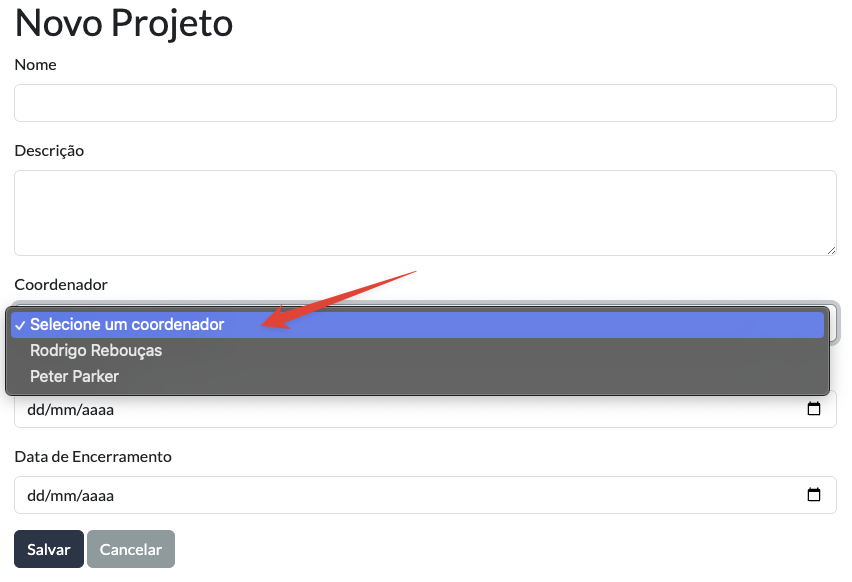
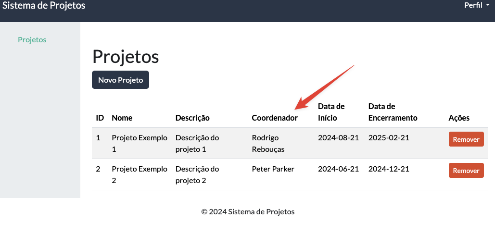

**Universidade Federal da Paraíba - UFPB** \
**Centro de Ciências Exatas e Educação - CCAE** \
**Departamento de Ciências Exatas - DCX**

**Professor:** [Rodrigo Rebouças de Almeida](http://rodrigor.dcx.ufpb.br)

# Atividade

1. Altere a entidade Projeto para receber um coordenador. Um projeto deve
   ter um coordenador. Na tela de cadastro de um projeto deve existir um
   campo "Coordenador" onde o usuário pode selecionar um dos coordenadores
   cadastrados, utilizando um menu.
   - Utilize a classe Coordenador e CoordenadorService já
     implementadas na atividade.

Exemplo:

