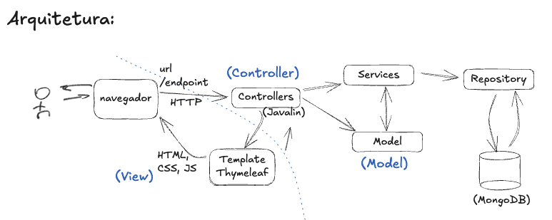

**Universidade Federal da Paraíba - UFPB** \
**Centro de Ciências Exatas e Educação - CCAE** \
**Departamento de Ciências Exatas - DCX**

**Professor:** [Rodrigo Rebouças de Almeida](http://rodrigor.com)

# Projeto de Referência: Sistema de Gestão de Projetos

Este é um projeto de referência para os alunos das disciplinas de Análise e 
Projeto de Sistemas e Projeto de Sistemas Orientados a Objetos dos cursos de 
Sistemas de Informação e Lic. em Ciência da Computação da UFPB, campus IV em 
Rio Tinto.

🚨 Atenção: Este projeto foi desenvolvido para servir como base para a implementação do 
projeto da disciplina. Ele é incompleto e possui vários pontos de melhoria 
propositais, que serão discutidos em sala de aula. Deste modo, não considere 
cegamente este projeto como uma referência para boas práticas de programação 
e um bom design. Repito, eu coloquei propositalmente alguns problemas de 
design que serão discutidos em sala de aula.

Trata-se de um projeto de controle de Projetos, onde, por enquanto é 
possível cadastrar projetos e participantes.

## Arquitetura do Projeto

A arquitetura do nosso sistema segue uma arquitetura típica de aplicações 
web - MVC(Model-View-Controller). Neste projeto utilizamos as seguintes 
tecnologias: com algumas tecnologias específicas.

- Tecnologias Utilizadas:
  - **Javalin**: Framework web leve para Java. (https://javalin.io/)
  - **Thymeleaf**: Motor de templates para renderização de páginas HTML. 
    (https://www.thymeleaf.org/)
  - **MongoDB**: Banco de dados NoSQL orientado a documentos. (https://www.mongodb.com/)
  - **Bootstrap**: Também estamos usando o Bootstrap para o estilo das páginas 
    HTML. (https://getbootstrap.com/)



Descrição dos elementos da arquitetura:

1. **Usuário/Navegador**:
   - Representa o usuário que interage com a aplicação por meio de um navegador web.
   - O navegador envia solicitações HTTP (URLs/endpoints) para a aplicação e recebe respostas (HTML, CSS, JS) para renderização.

2. **Controller (Controlador)**:
   - É implementado utilizando **Javalin**, um framework leve para desenvolvimento de aplicações web em Java.
   - O controlador recebe as requisições HTTP do navegador e decide qual serviço chamar para processar a lógica de negócio.
   - Depois de processada, a resposta é enviada para a camada de visualização (View) ou diretamente de volta ao navegador.

3. **View (Visão)**:
   - Utiliza **Thymeleaf**, um motor de templates em Java para renderizar páginas HTML.
   - Os controladores passam os dados necessários para a View, que gera o HTML dinâmico, que é então enviado de volta ao navegador.
   - Além de HTML, pode incluir CSS e JS para formar a interface do usuário.

4. **Model (Modelo)**:
   - Representa os dados e a lógica de negócio da aplicação.
   - Os serviços utilizam o modelo para manipular dados, que podem ser recebidos ou enviados para o repositório.

5. **Services (Serviços)**:
   - Contêm a lógica de negócio da aplicação.
   - Eles manipulam o modelo e coordenam as interações entre o controlador e o repositório.

6. **Repository (Repositório)**:
   - Responsável pela persistência dos dados.
   - Neste diagrama, está conectado a um banco de dados **MongoDB**.
   - O repositório abstrai as operações de banco de dados, permitindo que os serviços manipulem dados sem precisar conhecer os detalhes de implementação do armazenamento.

### Fluxo Geral:
- O usuário interage com o navegador, que envia uma requisição HTTP ao controlador via uma URL ou endpoint específico.
- O controlador, implementado em Javalin, processa a requisição chamando os serviços necessários.
- Os serviços acessam e manipulam os dados através do repositório, que persiste essas informações no MongoDB.
- O controlador então decide se a resposta será um HTML gerado pelo Thymeleaf (caso de uma página web) ou se deve enviar uma resposta diretamente ao navegador.

## Configuração do Projeto

1. Copie o arquivo `application.properties.exemplo` para `application.properties`:
   ```bash
   cp src/main/resources/application.properties.exemplo src/main/resources/application.properties
    ```
2. Edite o arquivo `application.properties` e insira a string de conexão do 
   seu banco de dados MongoDB: `mongodb.connectionString=<sua_string_de_conexão>`
3. Execute a aplicação a partir da classe `App`:
   ```bash
   mvn clean compile exec:java
   ```
